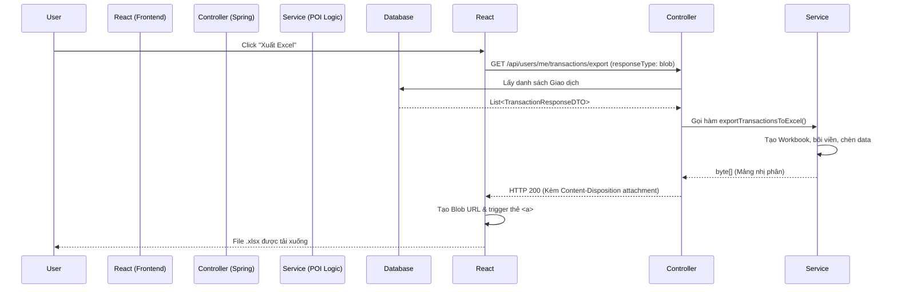

# Hướng Dẫn Kỹ Thuật: Xuất Dữ Liệu Excel (Export Excel) với Apache POI

Tài liệu này tổng hợp lại quy trình và kiến trúc xây dựng tính năng Xuất dữ liệu ra file Excel (Excel Export) trong Spring Boot kết hợp với giao diện ReactJS. Cụ thể áp dụng cho tính năng **Xuất Lịch Sử Giao Dịch**.

---

## 1. Tại Sao Lại Dùng Apache POI (Backend) Mà Không Sinh Bằng Frontend?

Trong thực tế doanh nghiệp, người ta ưu tiên xử lý file Excel ở phía **Backend** (dùng Java `Apache POI`) thay vì dùng JavaScript ở Frontend vì những lý do sau:
- **Xử lý dữ liệu lớn (Big Data):** Nếu hệ thống có 100.000 dòng dữ liệu, việc ép trình duyệt (Browser) tải về cục JSON khổng lồ rồi dùng RAM của máy người dùng nén thành Excel sẽ làm đứng máy. Backend có khả năng phân luồng và stream dữ liệu hiệu quả hơn nhiều (dùng `SXSSFWorkbook` của POI).
- **Bảo mật:** Backend kiểm soát phân quyền (Admin được xuất gì, User xuất gì), tránh việc vô tình đẩy thừa trường dữ liệu nhạy cảm xuống cho Client.
- **Tính thẩm mỹ và Format kế toán chuẩn:** POI hỗ trợ định dạng cột, bôi đậm, tô màu, thiết lập Auto-size cột và chuẩn hóa format tiền tệ (vd: `#,##0`) theo chuẩn của hệ điều hành.

---

## 2. Kiến Trúc Luồng Dữ Liệu (Flow)



---

## 3. Các Bước Cài Đặt Chi Tiết

### 3.1. Khai Báo Thư Viện (build.gradle)
Cần có thư viện `poi-ooxml` chuyên dùng để đọc/ghi định dạng Excel đời mới (`.xlsx` thay vì `.xls` cũ).
```gradle
implementation 'org.apache.poi:poi-ooxml:5.2.3'
```

### 3.2. Code Nghiệp Vụ Sinh File (ExcelExportServiceImpl.java)
Lớp dịch vụ này đảm nhận việc tạo cấu trúc lưới của Excel.

**Các bước chính:**
1. Tạo một `XSSFWorkbook` (File Excel) và một `Sheet` (Trang tính).
2. Định dạng **Header** (Màu nền xanh đậm, chữ trắng in đậm, bôi viền).
3. Định dạng **Row** (viền mỏng cho các ô) và **Money Format** (định dạng `#,##0` chuyên cho VNĐ).
4. Khởi tạo dòng đầu tiên (`Row 0`) chứa tên cột.
5. Vòng lặp `for` chạy qua mảng dữ liệu, cứ mỗi một item thì `createRow` rồi `createCell` và nhét giá trị vào.
6. Auto-size các cột để vừa chữ. Chuyển kết quả ra mảng Byte (`byte[]`).

*(Bạn có thể xem trực tiếp mã nguồn tại `src/main/java/com/example/java_basic/service/impl/ExcelExportServiceImpl.java`)*

### 3.3. Tầng Giao Tiếp Trả Về File (UserController.java)
Ở tầng API, chúng ta gọi xuống Service để nhận mảng Byte, sau đó thiết lập Header để ép trình duyệt phải hiểu đây là một file được tải xuống.
```java
@GetMapping("/me/transactions/export")
public ResponseEntity<byte[]> exportMyTransactions(Principal principal) {
    // 1. Lấy dữ liệu
    List<TransactionResponseDTO> transactions = userService.getMyTransactions(principal.getName());
    
    // 2. Chuyển dữ liệu thành Byte nhị phân
    byte[] excelBytes = excelExportService.exportTransactionsToExcel(transactions);

    // 3. Setup Header trả về trình duyệt
    HttpHeaders headers = new HttpHeaders();
    headers.set(HttpHeaders.CONTENT_DISPOSITION, "attachment; filename=transactions.xlsx");
    headers.set(HttpHeaders.CONTENT_TYPE, "application/vnd.openxmlformats-officedocument.spreadsheetml.sheet");

    return new ResponseEntity<>(excelBytes, headers, HttpStatus.OK);
}
```
**Lưu ý quan trọng:** `CONTENT_DISPOSITION` chứa `attachment; filename=...` là chìa khóa khiến trình duyệt biết cần lưu thành file có tên gì.

### 3.4. Xử Lý Phía ReactJS (History.jsx)
Ở Frontend, vì API trả về dữ liệu nhị phân (Binary) chứ không phải JSON như bình thường, nên Axios bắt buộc phải cấu hình `responseType: 'blob'`.
```javascript
const handleExportExcel = async () => {
    try {
        // Chú ý: Bắt buộc phải có responseType: 'blob'
        const res = await api.get('/api/users/me/transactions/export', { responseType: 'blob' });
        
        // Tạo đường link ảo (URL) trỏ vào dữ liệu Blob trên RAM
        const url = window.URL.createObjectURL(new Blob([res.data]));
        
        // Tạo thẻ <a> ẩn, gán link và giả lập thao tác click
        const link = document.createElement('a');
        link.href = url;
        link.setAttribute('download', 'Lich_Su_Giao_Dich.xlsx'); // Tên file tải về
        document.body.appendChild(link);
        link.click();
        
        // Dọn dẹp
        link.remove();
        window.URL.revokeObjectURL(url);
    } catch (error) {
        alert('Có lỗi xảy ra khi xuất file Excel');
    }
};
```

## 4. Tổng Kết
Sự kết hợp giữa sức mạnh format của **Apache POI** (Backend) và kỹ thuật download **Blob URL** của Axios (Frontend) tạo ra một trải nghiệm người dùng cực mượt mà, chuyên nghiệp và có thể tái sử dụng (scale) ra mọi màn hình báo cáo khác của hệ thống sau này.
