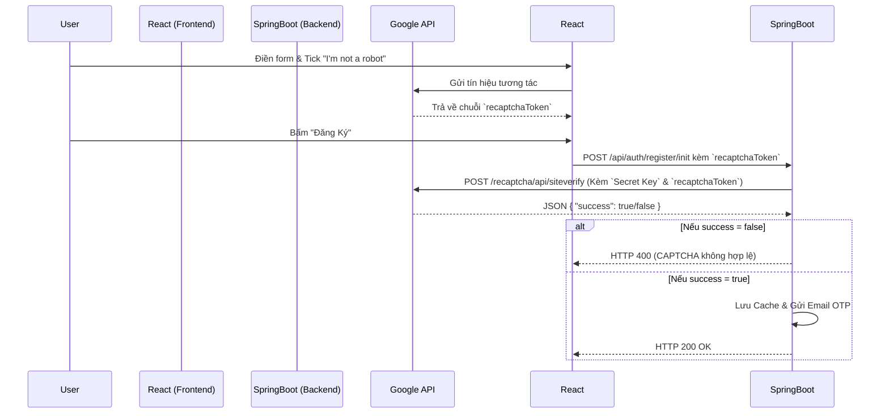

# Hướng Dẫn Kỹ Thuật: Tích hợp Google reCAPTCHA v2 Chống Bot Spam

Tài liệu này tổng hợp lại kiến trúc và cách thức tích hợp Google reCAPTCHA v2 vào luồng Đăng ký tài khoản. Mục đích của tính năng này là ngăn chặn các cuộc tấn công DDoS vào hệ thống tạo tài khoản rác (Bot Spam) làm tiêu tốn tài nguyên và hạn ngạch gửi Email OTP.

---

## 1. Tại Sao Lại Chọn Google reCAPTCHA v2 (Checkbox)?

Có rất nhiều loại CAPTCHA (Sinh hình ảnh, tính toán phép toán, reCAPTCHA v3 chạy ẩn), nhưng v2 Checkbox ("I'm not a robot") được lựa chọn vì:
- **Trải nghiệm quen thuộc:** Người dùng đã quá quen với thao tác click vào ô này trên các website lớn.
- **Tính bảo mật cao:** Google sử dụng AI và lịch sử duyệt web để chấm điểm rủi ro. Nếu nghi ngờ, nó sẽ bắt người dùng chọn hình ảnh (Traffic lights, Crosswalks).
- **Tránh nhầm lẫn:** reCAPTCHA v3 chạy ẩn đôi khi chặn nhầm người dùng thật (False Positive) mà không cho họ cơ hội chứng minh mình là con người.

---

## 2. Kiến Trúc Luồng Xác Thực (Flow)

Luồng xác thực cần sự kết hợp chặt chẽ giữa 3 bên: **Trình duyệt (Client)**, **Server Backend (Spring Boot)** và **Server của Google**.



---

## 3. Các Bước Triển Khai Chi Tiết

### 3.1. Cấu Hình Biến Môi Trường (Backend)
Backend cần một `Secret Key` do Google cấp để chứng minh danh tính khi gọi API.
```properties
# src/main/resources/application.properties
google.recaptcha.secret-key=YOUR_SECRET_KEY
```
*(Hiện tại hệ thống đang dùng Test Key mặc định của Google để thuận tiện cho việc phát triển trên localhost).*

### 3.2. Dịch Vụ Gọi API Google (CaptchaServiceImpl)
Sử dụng `RestTemplate` để bắn HTTP POST Request lên Google.

```java
@Service
public class CaptchaServiceImpl implements CaptchaService {
    
    @Value("${google.recaptcha.secret-key}")
    private String recaptchaSecretKey;

    public boolean verifyToken(String token) {
        RestTemplate restTemplate = new RestTemplate();
        MultiValueMap<String, String> requestMap = new LinkedMultiValueMap<>();
        requestMap.add("secret", recaptchaSecretKey);
        requestMap.add("response", token);

        ResponseEntity<Map> response = restTemplate.postForEntity(
            "https://www.google.com/recaptcha/api/siteverify", 
            requestMap, 
            Map.class
        );
        
        return Boolean.TRUE.equals(response.getBody().get("success"));
    }
}
```

### 3.3. Bảo Vệ API Đăng Ký (AuthServiceImpl)
Ngay đầu hàm khởi tạo đăng ký, hệ thống phải kiểm tra token trước khi truy vấn Database hay gửi Email.
```java
public void initiateRegistration(RegisterRequestDTO request) {
    if (!captchaService.verifyToken(request.getRecaptchaToken())) {
        throw new IllegalArgumentException("Xác thực CAPTCHA thất bại, vui lòng thử lại.");
    }
    // Logic gửi OTP...
}
```

### 3.4. Giao Diện ReactJS (Register.jsx)
Cài đặt thư viện `react-google-recaptcha` để hiển thị Widget.
- **Quản lý State:** Lưu trữ Token khi người dùng tick thành công.
- **Khóa Nút Bấm:** Vô hiệu hóa nút "Đăng Ký" nếu Token bị rỗng (Chưa tick).
- **Reset UI:** Nếu có lỗi xảy ra (vd: Trùng Email), phải dùng `useRef` để gọi lệnh `.reset()` nhằm bỏ dấu tick xanh, bắt người dùng tick lại.

```jsx
<ReCAPTCHA
    ref={recaptchaRef}
    sitekey="YOUR_SITE_KEY"
    onChange={(token) => setRecaptchaToken(token)}
    onExpired={() => setRecaptchaToken(null)}
/>
```

---

## 4. Hướng Dẫn Deploy Lên Production

Khi đưa website lên môi trường mạng Internet thực tế, hãy làm theo các bước sau:
1. Truy cập [Google reCAPTCHA Admin Console](https://www.google.com/recaptcha/admin).
2. Tạo dự án mới, chọn loại **reCAPTCHA v2 ("I'm not a robot" Checkbox)**.
3. Điền các Domain thật của bạn (Ví dụ: `caulong.com`, `api.caulong.com`).
4. Google sẽ cấp cho bạn 2 khóa:
   - **Site Key:** Đem thay vào thuộc tính `sitekey` trong file `Register.jsx` ở Frontend.
   - **Secret Key:** Đem thay vào biến `google.recaptcha.secret-key` trong file `application.properties` ở Backend.
5. Chạy lại (Build & Restart) cả Frontend và Backend để áp dụng.
