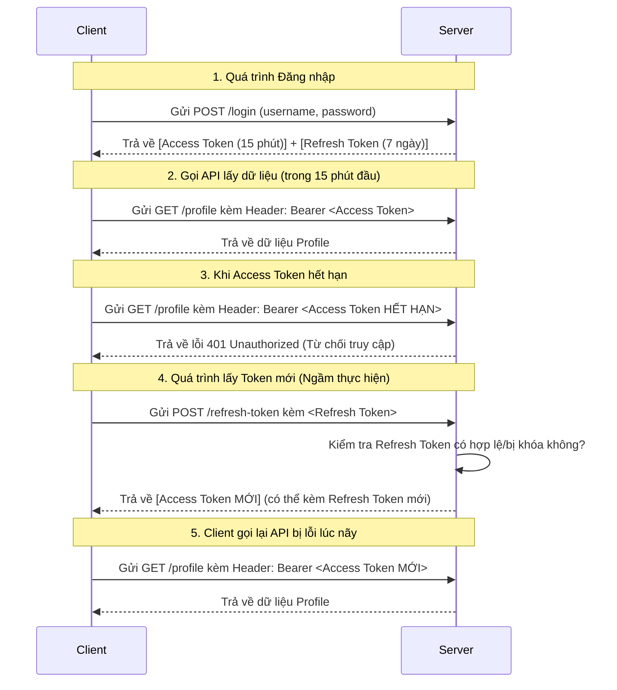

# Tài Liệu Chi Tiết: Spring AOP, Custom Annotation, Generic & Refresh Token

Tài liệu này cung cấp các ví dụ code thực tế trong môi trường dự án Java/Spring Boot để làm rõ các khái niệm lý thuyết.

## 1. Kết hợp Custom Annotation và Spring AOP
Trong Spring Boot, **Custom Annotation** và **AOP** thường đi như một cặp bài trùng.

**Bài toán:** Bạn muốn đo thời gian chạy của bất kỳ hàm nào trong hệ thống mà không muốn phải viết các dòng code tính toán thời gian lặp đi lặp lại ở khắp mọi nơi.

### Bước 1: Tạo Custom Annotation
Tạo một annotation mang tên `@TrackTime`.
```java
import java.lang.annotation.ElementType;
import java.lang.annotation.Retention;
import java.lang.annotation.RetentionPolicy;
import java.lang.annotation.Target;

@Target(ElementType.METHOD) // Chỉ được gắn lên các Method (hàm)
@Retention(RetentionPolicy.RUNTIME) // Tồn tại khi chương trình đang chạy để AOP đọc được
public @interface TrackTime {
    // Annotation này không cần thuộc tính nào cả. 
    // Nó chỉ đóng vai trò như 1 cái "nhãn dán" (marker).
}
```

### Bước 2: Tạo Aspect (AOP) để xử lý logic
Bây giờ, ta cấu hình AOP: "Cứ hàm nào có dán nhãn `@TrackTime` thì hãy tính thời gian chạy của nó".

```java
import org.aspectj.lang.ProceedingJoinPoint;
import org.aspectj.lang.annotation.Around;
import org.aspectj.lang.annotation.Aspect;
import org.springframework.stereotype.Component;
import lombok.extern.slf4j.Slf4j;

@Aspect      // Khai báo đây là một Aspect
@Component   // Đưa vào Spring Context quản lý
@Slf4j
public class TimeTrackerAspect {

    // @Around sẽ bao bọc toàn bộ quá trình thực thi của hàm mục tiêu.
    // "@annotation(com.example.annotation.TrackTime)" chính là Pointcut: 
    // Áp dụng cho tất cả các hàm có gắn @TrackTime
    @Around("@annotation(com.example.annotation.TrackTime)")
    public Object trackTime(ProceedingJoinPoint joinPoint) throws Throwable {
        long startTime = System.currentTimeMillis();
        
        // Cho phép hàm gốc được thực thi (ví dụ hàm processHeavyTask)
        Object result = joinPoint.proceed(); 
        
        long endTime = System.currentTimeMillis();
        
        // joinPoint.getSignature().getName() lấy ra tên của hàm đang chạy
        log.info("Hàm {} chạy mất: {} ms", joinPoint.getSignature().getName(), (endTime - startTime));
        
        return result;
    }
}
```

### Bước 3: Sử dụng
Bây giờ, logic nghiệp vụ của bạn cực kỳ sạch sẽ. Chỉ cần gắn nhãn là xong.

```java
import org.springframework.stereotype.Service;

@Service
public class UserService {

    @TrackTime // Gắn nhãn để AOP tự động đo thời gian
    public String processHeavyTask() throws InterruptedException {
        Thread.sleep(2000); // Giả lập hàm xử lý mất 2 giây
        return "Thành công";
    }
}
```

---

## 2. Generic Trong Thực Tế (API Response)
**Generic** thường được dùng nhất khi bạn muốn bọc (wrap) dữ liệu trả về cho Client theo một chuẩn duy nhất, bất kể dữ liệu bên trong là 1 `User`, 1 `Product`, hay 1 `List<Order>`.

**Bài toán:** API lúc trả về chuỗi, lúc trả về Object, lúc trả về List. Frontend yêu cầu định dạng chuẩn gồm: `status`, `message`, `data`.

### Cấu trúc Generic
Chữ `T` đại diện cho một Type (Kiểu) bất kỳ.

```java
import lombok.AllArgsConstructor;
import lombok.Data;

@Data
@AllArgsConstructor
public class ApiResponse<T> {
    private int status;
    private String message;
    private T data; // Kiểu dữ liệu linh hoạt (có thể là User, Product, String...)
}
```

### Sử dụng trong Controller
```java
@RestController
@RequestMapping("/api/users")
public class UserController {

    // Trả về ApiResponse bọc 1 String
    @GetMapping("/hello")
    public ApiResponse<String> sayHello() {
        return new ApiResponse<>(200, "Thành công", "Xin chào Generic");
    }

    // Trả về ApiResponse bọc 1 Object User
    @GetMapping("/{id}")
    public ApiResponse<User> getUser(@PathVariable Long id) {
        User user = new User(id, "Nguyen Van A");
        return new ApiResponse<>(200, "Lấy thông tin thành công", user);
    }

    // Trả về ApiResponse bọc 1 Danh sách User
    @GetMapping("/all")
    public ApiResponse<List<User>> getAllUsers() {
        List<User> users = List.of(new User(1L, "A"), new User(2L, "B"));
        return new ApiResponse<>(200, "Thành công", users);
    }
}
```
*Nhờ Generic, ta chỉ cần 1 class `ApiResponse<T>`, không phải viết rời rạc các class như `StringResponse`, `UserResponse`, `UserListResponse`.*

---

## 3. Cơ chế Refresh Token
Để dễ hiểu, ta xem biểu đồ luồng hoạt động giữa Client (Web/Mobile) và Server:



### Ví dụ Code:
```java
// DTO Trả về khi đăng nhập hoặc refresh thành công
public class JwtResponse {
    private String accessToken;  // Sống 15 phút
    private String refreshToken; // Sống 7 ngày
    // constructor, getter, setter...
}

@RestController
public class AuthController {

    @PostMapping("/refresh-token")
    public ResponseEntity<?> refreshToken(@RequestBody RefreshTokenRequest request) {
        String requestRefreshToken = request.getRefreshToken();

        // 1. Tìm Refresh Token trong Database xem có tồn tại không
        RefreshToken tokenInDb = refreshTokenService.findByToken(requestRefreshToken)
            .orElseThrow(() -> new RuntimeException("Refresh token không tồn tại!"));

        // 2. Kiểm tra xem Refresh Token đã hết hạn chưa (ví dụ đã qua 7 ngày)
        if (tokenInDb.getExpiryDate().isBefore(Instant.now())) {
            refreshTokenService.delete(tokenInDb); // Xóa token cũ
            throw new RuntimeException("Refresh token đã hết hạn. Vui lòng đăng nhập lại!");
        }

        // 3. Nếu mọi thứ OK, tạo Access Token MỚI cho user đó
        User user = tokenInDb.getUser();
        String newAccessToken = jwtUtils.generateAccessTokenFromUsername(user.getUsername());

        // 4. Trả về Access Token mới cho Client (giữ nguyên Refresh Token cũ)
        return ResponseEntity.ok(new JwtResponse(newAccessToken, requestRefreshToken));
    }
}
```
