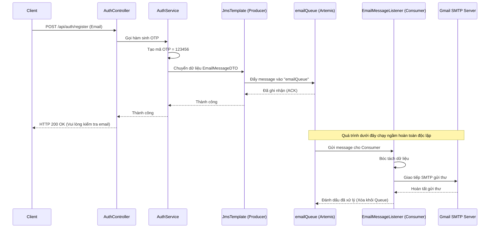

# Hướng Dẫn Tích Hợp JMS (ActiveMQ Artemis) Trong Spring Boot 3

Tài liệu này tổng hợp lại kiến thức và các bước thực hành để tích hợp hệ thống hàng đợi thông điệp (Message Queue) vào dự án Spring Boot, sử dụng **Java Message Service (JMS)** với Broker là **ActiveMQ Artemis** (chạy ở chế độ nhúng - Embedded).

*Ghi chú: Dưới đây là cấu trúc các file thực tế đã áp dụng trong dự án này để bạn tiện tra cứu lại.*

## 1. Tại sao lại dùng JMS thay vì `@Async`?

Trước đây, hệ thống gửi Email (VD: OTP Đăng ký, Nhắc nợ) bằng cách dùng Annotation `@Async`. Phương pháp này tạo ra một luồng (thread) mới trên RAM để chạy ngầm. Tuy nhiên, nó có một nhược điểm chí mạng:
- **Nguy cơ mất dữ liệu:** Nếu server đột ngột bị tắt (crash, cúp điện, restart), các tác vụ gửi Email đang nằm chờ trong hàng đợi của luồng sẽ bị xóa sạch khỏi RAM. Khách hàng sẽ không bao giờ nhận được email đó nữa.
- **JMS giải quyết vấn đề:** Với JMS, thông điệp (email cần gửi) sẽ được lưu trữ an toàn vào một Hàng đợi (Queue) của Message Broker. Broker có khả năng ghi xuống ổ cứng (persistence). Dù server có sập, khi khởi động lại, thông điệp vẫn còn đó và sẽ được xử lý tiếp.

---

## 2. Luồng Xử Lý (Processing Flow)

Quy trình gửi Email thông qua Message Queue được chia làm 3 giai đoạn độc lập:

1. **Khởi tạo (Producer):** Hàm nghiệp vụ tạo ra một "Phong bì" chứa dữ liệu (ví dụ: Địa chỉ email người nhận, mã OTP).
2. **Lưu trữ (Broker):** Phong bì này được ném vào một hàng đợi có tên là `emailQueue`. Khi phong bì đã nằm trong hàng đợi, hàm API ngay lập tức trả kết quả về cho Client (chưa cần biết email đã gửi thành công chưa), giúp tăng tốc độ phản hồi từ 3-5 giây xuống dưới 10 mili-giây.
3. **Tiêu thụ (Consumer):** Một luồng chạy ngầm của hệ thống sẽ liên tục rình xem `emailQueue` có phong bì nào không. Khi thấy có, nó sẽ bóc phong bì ra và thực thi lệnh kết nối với máy chủ SMTP (như Gmail) để gửi email thực sự.



---

## 3. Các Bước Cài Đặt

### Bước 1: Khai báo thư viện (Dependencies)
**File áp dụng:** `build.gradle`

Thêm các thư viện của Artemis (Lưu ý Spring Boot 3 yêu cầu jakarta thay vì javax):
```gradle
// Thư viện JMS cơ bản của Spring Boot
implementation 'org.springframework.boot:spring-boot-starter-artemis'

// Cụm thư viện để chạy ActiveMQ Artemis ngay bên trong (Embedded) ứng dụng
implementation 'org.apache.activemq:artemis-server'
implementation 'org.apache.activemq:artemis-jms-server'
implementation 'org.apache.activemq:artemis-jakarta-server'
```

### Bước 2: Cấu hình hệ thống
**File áp dụng:** `src/main/resources/application.properties`

```properties
# Bật chế độ chạy nhúng (không cần cài phần mềm ActiveMQ bên ngoài)
spring.artemis.mode=embedded
spring.artemis.embedded.enabled=true
# Tự động tạo một hàng đợi tên là emailQueue
spring.artemis.embedded.queues=emailQueue

# (QUAN TRỌNG) Cho phép giải mã (deserialize) các object Java một cách an toàn
spring.artemis.packages.trust-all=true
```

### Bước 3: Kích hoạt JMS
**File áp dụng:** `src/main/java/com/example/java_basic/JavaBasicApplication.java`

Vào class chạy chính, thêm Annotation `@EnableJms`:
```java
@SpringBootApplication
@EnableJms // Thêm dòng này
public class JavaBasicApplication {
    public static void main(String[] args) {
        SpringApplication.run(JavaBasicApplication.class, args);
    }
}
```

---

## 4. Áp Dụng Thực Tế (Mô hình Producer - Consumer)

### 4.1. DTO (Data Transfer Object)
**File áp dụng:** `src/main/java/com/example/java_basic/dto/EmailMessageDTO.java`

Tạo một Class đại diện cho "Phong bì thư" chứa dữ liệu.
**Lưu ý:** Bắt buộc phải implements `Serializable` thì mới truyền qua mạng / lưu vào Queue được.
```java
@Data
@Builder
public class EmailMessageDTO implements Serializable {
    private static final long serialVersionUID = 1L; // Bắt buộc
    private String to;         // Email người nhận
    private String subject;    // Tiêu đề email
    private String text;       // Nội dung email
}
```

### 4.2. Producer (Người gửi thông điệp)
**File áp dụng:** `src/main/java/com/example/java_basic/service/impl/AuthServiceImpl.java` (hoặc EmailServiceImpl)

Sử dụng công cụ `JmsTemplate` do Spring Boot cung cấp để ném "Phong bì" vào Queue.
```java
@Service
@RequiredArgsConstructor
public class AuthServiceImpl implements AuthService {

    private final JmsTemplate jmsTemplate; // Tiêm JmsTemplate vào

    @Override
    public void register(UserRegistrationRequest request) {
        // ... (Logic tạo mã OTP) ...
        String otpCode = generateOtp();

        // 1. Tạo phong bì
        EmailMessageDTO message = EmailMessageDTO.builder()
                .to(request.getEmail())
                .subject("Mã xác nhận đăng ký")
                .text("Mã OTP của bạn là: " + otpCode)
                .build();

        // 2. Ném vào Queue có tên "emailQueue"
        jmsTemplate.convertAndSend("emailQueue", message);
        
        // Quá trình convertAndSend diễn ra < 1ms, API return ngay lập tức!
    }
}
```

### 4.3. Consumer (Người nhận thông điệp)
**File áp dụng:** `src/main/java/com/example/java_basic/listener/EmailMessageListener.java`

Tạo một Component riêng biệt, gắn Annotation `@JmsListener`. Spring Boot sẽ tự động tạo một luồng chạy ngầm (Worker), liên tục theo dõi Queue này. Hễ có phong bì rơi vào, nó sẽ lấy ra xử lý.
```java
@Component
@RequiredArgsConstructor
public class EmailMessageListener {

    private final JavaMailSender javaMailSender;

    @JmsListener(destination = "emailQueue") // Lắng nghe hàng đợi này
    public void receiveEmailMessage(EmailMessageDTO emailDto) {
        try {
            // Khởi tạo thư viện gửi Mail
            MimeMessage message = javaMailSender.createMimeMessage();
            MimeMessageHelper helper = new MimeMessageHelper(message, true, "UTF-8");
            
            // Bóc tách dữ liệu từ DTO để dán vào Mail
            helper.setTo(emailDto.getTo());
            helper.setSubject(emailDto.getSubject());
            helper.setText(emailDto.getText(), true);
            
            // Thực thi việc kết nối SMTP (Tốn 3-5 giây)
            javaMailSender.send(message);
        } catch (Exception e) {
            // Bắt lỗi và ghi Log (Nếu lỗi gửi thư, không làm sập ứng dụng chính)
            System.err.println("Lỗi khi gửi email: " + e.getMessage());
        }
    }
}
```

## 5. Kết luận
Nhờ JMS, hàm API chính chỉ mất chưa đến 1ms để đẩy yêu cầu vào Queue thay vì phải chờ 3-5 giây cho việc tương tác với máy chủ Gmail hoàn tất. Tốc độ phản hồi của API tăng lên đáng kể, trải nghiệm người dùng (UX) tốt hơn, đồng thời đảm bảo không bị thất thoát dữ liệu ngay cả khi hệ thống sập giữa chừng!