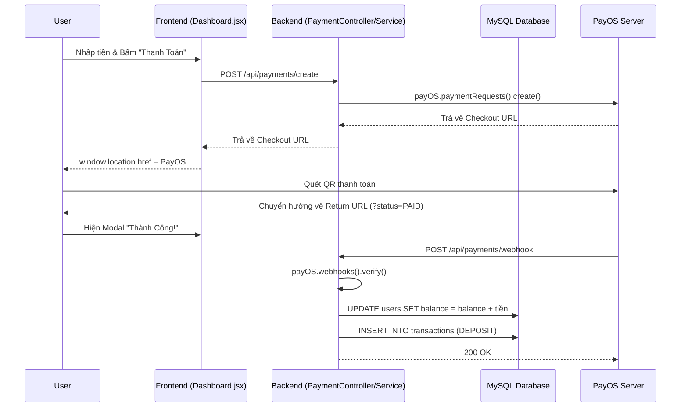

# Luồng Xử Lý Thanh Toán Qua PayOS

Tài liệu này mô tả chi tiết luồng hoạt động tích hợp cổng thanh toán PayOS trong hệ thống, bao gồm các hàm và đoạn mã cụ thể đảm nhận từng tác vụ.

## 1. Luồng Tạo Mã Thanh Toán (Checkout)
Quy trình này diễn ra khi người dùng yêu cầu nạp tiền vào tài khoản.

1. **Người dùng (Frontend - `Dashboard.jsx`):** 
   - Truy cập trang Dashboard, nhập số tiền và nhấn nút "Thanh Toán Qua PayOS".
   - Frontend thực thi hàm `onClick` để gọi API:
     ```javascript
     const res = await api.post('/api/payments/create', { 
         amount: topupAmount,
         returnUrl: window.location.href
     });
     window.location.href = res.data.checkoutUrl;
     ```
2. **Hệ thống (Backend - `PaymentController.java`):**
   - API `@PostMapping("/create")` nhận yêu cầu:
     ```java
     public ResponseEntity<Map<String, String>> createPaymentLink(...) {
         String username = authentication.getName();
         // Tìm user và gọi sang Service
         String checkoutUrl = paymentService.createPaymentLink(userId, amount, returnUrl);
         return ResponseEntity.ok(Map.of("checkoutUrl", checkoutUrl));
     }
     ```
3. **Hệ thống (Backend - `PaymentServiceImpl.java`):**
   - Hàm `createPaymentLink` thực hiện xây dựng cấu trúc dữ liệu theo chuẩn PayOS:
     ```java
     public String createPaymentLink(Long userId, int amount, String returnUrl) {
         long orderCode = Long.parseLong(userId + "" + (System.currentTimeMillis() % 1000000000));
         
         PaymentLinkItem item = PaymentLinkItem.builder().name("Nap tien...").quantity(1).price((long) amount).build();
         CreatePaymentLinkRequest request = CreatePaymentLinkRequest.builder()
             .orderCode(orderCode).amount((long) amount).description("NAP " + userId)
             .returnUrl(returnUrl).cancelUrl(returnUrl).items(List.of(item)).build();

         // Gọi PayOS SDK
         CreatePaymentLinkResponse data = payOS.paymentRequests().create(request);
         return data.getCheckoutUrl();
     }
     ```

## 2. Luồng Xử Lý Kết Quả Thanh Toán (Return URL)
Quy trình này diễn ra khi người dùng quét mã xong hoặc hủy thanh toán, PayOS điều hướng người dùng về lại trang web.

1. **Người dùng (Frontend - `Dashboard.jsx`):**
   - Hook `useEffect` sẽ chạy ngay khi trang được tải lại để bắt các tham số trên URL (`?code=00&status=PAID...`):
     ```javascript
     useEffect(() => {
         const urlParams = new URLSearchParams(window.location.search);
         const code = urlParams.get('code');
         const status = urlParams.get('status');
         
         if (code === '00' && status === 'PAID') {
             setShowSuccessModal(true);
             // Xóa params khỏi URL để F5 không bị hiển thị lại modal
             window.history.replaceState(null, '', window.location.pathname);
         }
     }, []);
     ```
   - Khi modal bật lên, người dùng ấn nút "Tuyệt vời", mã sẽ ép trang reload để lấy số dư mới nhất:
     ```javascript
     <button onClick={() => {
         setShowSuccessModal(false);
         window.location.reload(); // Gọi lại /api/users/me để cập nhật Balance
     }}>
     ```

## 3. Luồng Ghi Nhận Số Dư Tự Động (Webhook)
Luồng này chạy ngầm giữa Server của PayOS và Backend của hệ thống để đảm bảo cộng tiền tự động.

1. **Hệ thống (Backend - `PaymentController.java`):**
   - API `@PostMapping("/webhook")` tiếp nhận cục dữ liệu `Webhook` từ PayOS:
     ```java
     @PostMapping("/webhook")
     public ResponseEntity<Map<String, String>> handleWebhook(@RequestBody Webhook request) {
         paymentService.processWebhook(request);
         return ResponseEntity.ok(Map.of("message", "success")); // Trả về 200 OK cho PayOS
     }
     ```
2. **Hệ thống (Backend - `PaymentServiceImpl.java`):**
   - Hàm `processWebhook` đảm nhận xác thực chữ ký (Signature) và cập nhật Database:
     ```java
     @Transactional
     public void processWebhook(Webhook webhookBody) {
         // 1. Xác thực nguồn gốc dữ liệu từ PayOS
         WebhookData data = payOS.webhooks().verify(webhookBody);
         
         if (!"00".equals(data.getCode())) return;

         // 2. Chống lặp (Idempotency) - Tránh cộng tiền 2 lần cho 1 mã đơn hàng
         String externalRef = String.valueOf(data.getOrderCode());
         if (transactionRepository.existsByExternalRef(externalRef)) return;

         // 3. Tách userId từ description (Ví dụ: "NAP 5" -> ID = 5)
         // ... code parse chuỗi ...

         if (userId != null) {
             User user = userRepository.findById(userId).orElse(null);
             if (user != null) {
                 // 4. Cộng tiền vào ví (Balance)
                 user.setBalance(user.getBalance().add(BigDecimal.valueOf(data.getAmount())));
                 userRepository.save(user);

                 // 5. Lưu Log lịch sử giao dịch (Transaction)
                 Transaction transaction = new Transaction();
                 transaction.setUser(user);
                 transaction.setAmount(BigDecimal.valueOf(data.getAmount()));
                 transaction.setTransactionType(TransactionType.DEPOSIT);
                 transaction.setExternalRef(externalRef);
                 transactionRepository.save(transaction);
             }
         }
     }
     ```

---
Sơ đồ cơ bản:

